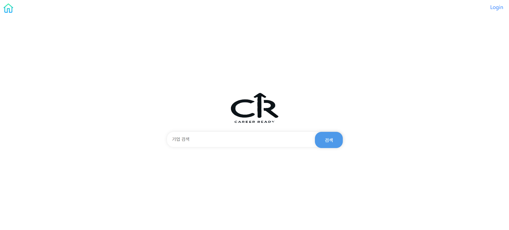
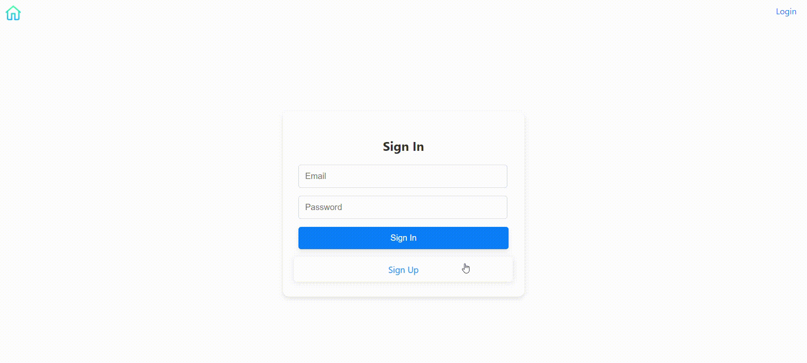
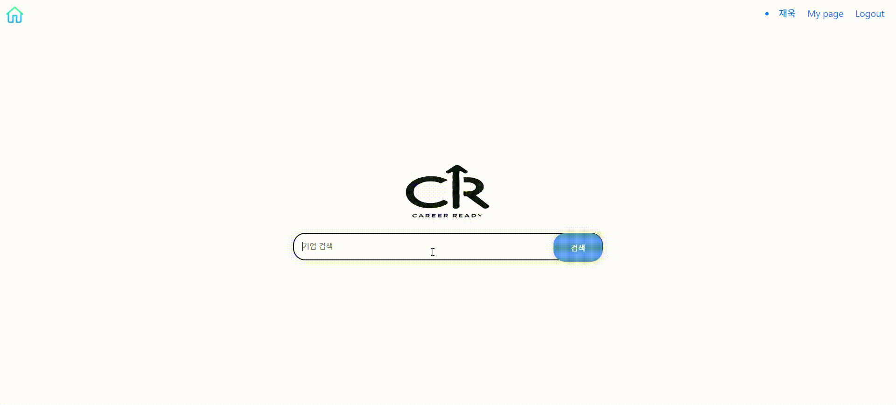
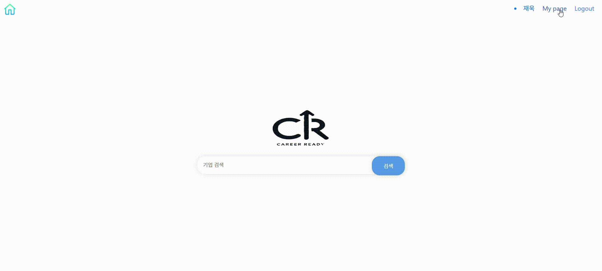
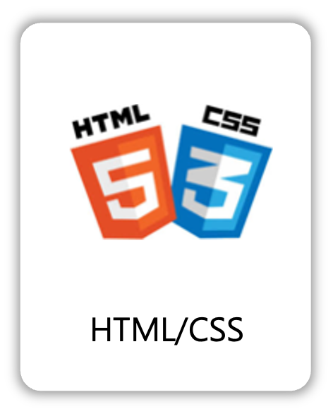

<!-- 프로젝트 로고 -->

### Recycle Project ✅

  

 

## 📝 소개
자기소개서를 작성하면서 회사에 대한 정보를 함께 얻을 수 있도록 만들게 되었습니다

- 프로젝트 소개
- 사용된 기술 스택
- 기술적 이슈와 해결 과정
- 프로젝트 팀원 정보

모든 관련 이미지 파일은 `readme` 폴더 안에 저장되어 있습니다.

 

## 🌟 프로젝트 화면 구성 및 프로토타입

### 화면 구성
| 로그인 화면 | 회사 정보 검색 |
|:---:|:---:|
|  |  |
| 자소서&이력서 작성 | 마이페이지 |
|  |  |

 

## ⚙ 사용 기술 스택
프로젝트에서 사용된 기술 스택을 한 눈에 확인할 수 있습니다. 각 기술의 로고는 `readme/skills` 폴더에서 가져옵니다.

### Back-end

    
    
    

### Front-end

    
    
    

### Tools

    

 

## 🤔 기술적 이슈와 해결 과정
각자 자신이 쓴 글을 올려주세요(링크걸어주세요)
- 황재욱
    <!-- - [Stream API에 대하여](https://velog.io/@yewo2nn16/Java-Stream-API) -->

- 서성우
    <!-- - [Stream API에 대하여](https://velog.io/@yewo2nn16/Java-Stream-API) -->

- 김민준
    <!-- - [Stream API에 대하여](https://velog.io/@yewo2nn16/Java-Stream-API) -->

- 이금주
    <!-- - [Stream API에 대하여](https://velog.io/@yewo2nn16/Java-Stream-API) -->

 

## 💁‍♂️ 프로젝트 팀원
| Backend | Frontend | Frontend | Frontend |
|:---:|:---:|:---:|:---:|
|  |   |  |  |  |
| [황재욱](https://github.com/jeauk) | [서성우](https://github.com/loteim) | [김민준](https://github.com/km8026) | [이금주](https://github.com/l0cyp) |

